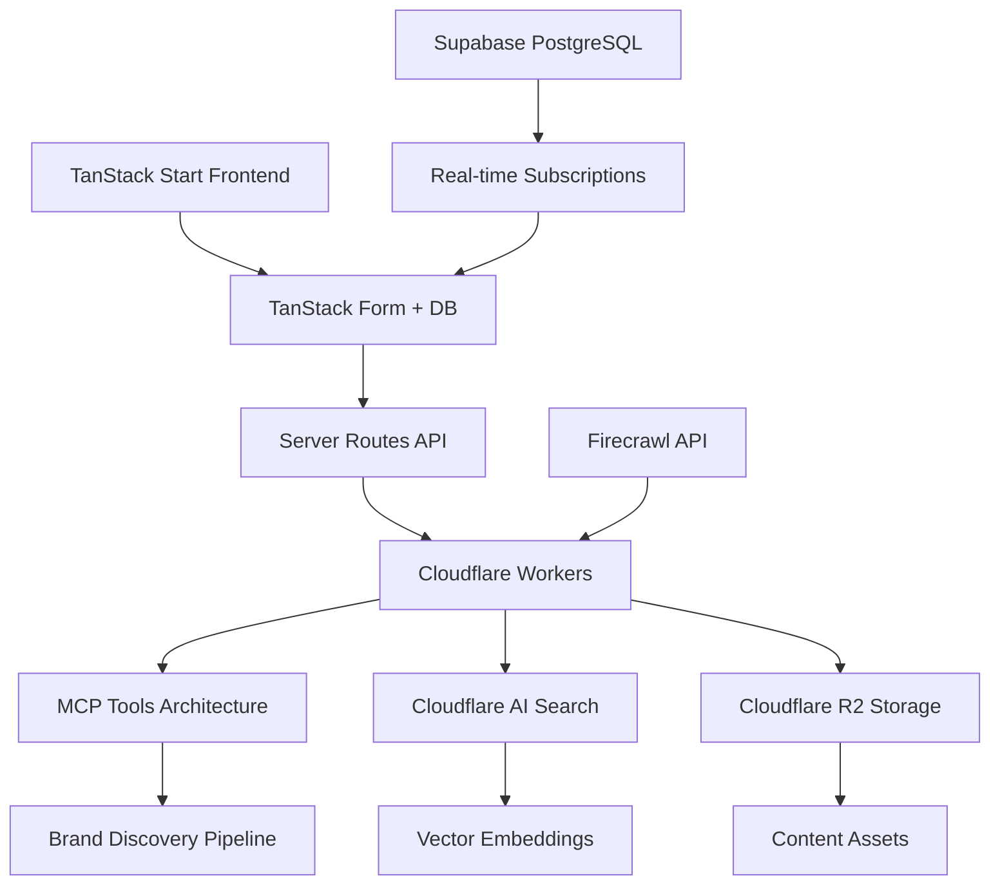

# 🚀 Tedix — Modern AI-Commerce Platform

**Built with TanStack Start + Cloudflare for the AI-first future of commerce**

> A production-ready AI-commerce platform featuring **TanStack Start**, **Cloudflare Workers**, **real-time brand intelligence**, and **ChatGPT-style interfaces** for seamless brand integration into AI conversations.

   

## 🎯 **Vision**

Transform how brands integrate into AI conversations using modern web standards. Built with **TanStack Start** for full-stack type safety, **Cloudflare Workers** for edge computing, and **real-time reactive data** for professional shopping experiences.

## 🌐 **Live Demo**

**Experience the platform:** [http://localhost:3001/playground](http://localhost:3001/playground)

### **Try These Features:**
- 🔍 **"nike.com"** → Real-time brand content analysis
- 📱 **Responsive Design** → ChatGPT-style mobile interface
- ⚡ **Live Updates** → TanStack DB reactive queries
- 🤖 **AI Integration** → Professional AI Elements components

---

## ✨ **Modern Architecture**

### 🏗️ **Frontend Stack**
- **TanStack Start** — Full-stack React with file-based routing
- **TanStack Form** — Type-safe reactive forms with validation
- **TanStack DB** — Client-side reactive database with live queries
- **TanStack Query** — Server state management and caching
- **AI Elements** — Official ChatGPT-style UI components
- **Vite + TypeScript** — Modern build system with HMR

### ⚡ **Backend Stack**
- **Cloudflare Workers** — Serverless edge computing
- **MCP Architecture** — Model Context Protocol for AI tools
- **Cloudflare AI Search** — Managed vector database with auto-indexing
- **Cloudflare R2** — Object storage for brand content
- **Firecrawl API** — Premium content extraction and mapping

### 💾 **Database & State**
- **Supabase PostgreSQL** — Primary database with real-time features
- **pgvector Extension** — Vector storage for embeddings
- **TanStack DB Collections** — Client-side reactive data
- **Real-time Subscriptions** — Live data synchronization

---

## 🚀 **Quick Start**

### Prerequisites
```bash
node >= 18
bun >= 1.0
wrangler >= 3.0
```

### Installation & Setup
```bash
# Clone the repository
git clone https://github.com/your-repo/tedix-402
cd tedix-402

# Frontend setup (TanStack Start)
cd frontend
bun install
cp .env.example .env.local
# Configure your environment variables

# Backend setup (Cloudflare Workers)
cd ../backend
bun install
cp wrangler.example.jsonc wrangler.jsonc
# Configure your Cloudflare settings
```

### Development
```bash
# Terminal 1: Frontend (TanStack Start)
cd frontend
bun run dev
# → http://localhost:3001

# Terminal 2: Backend (Cloudflare Workers)
cd backend
bun run dev
# → http://localhost:8787

# Visit: http://localhost:3001/playground
```

### Production Build
```bash
# Frontend build
cd frontend
bun run build

# Backend deploy
cd backend
bun run deploy
```

---

## 🏗️ **Architecture Overview**



### **Data Flow**
1. **User Input** → TanStack Form validates domain
2. **Server Route** → Proxies to Cloudflare Worker
3. **Content Extraction** → Firecrawl processes brand content
4. **Storage** → Direct upload to Cloudflare R2
5. **Indexing** → AI Search auto-generates embeddings
6. **Real-time Updates** → TanStack DB live queries sync results
7. **AI Integration** → MCP tools provide ChatGPT-style interactions

---

## 🎨 **Key Features**

### ⚡ **Modern Web Development**
- **Full-stack TypeScript** with end-to-end type safety
- **File-based routing** with TanStack Start conventions
- **Reactive forms** with real-time validation and feedback
- **Hot module replacement** for instant development updates
- **Edge deployment** with global Cloudflare distribution

### 🤖 **AI-Powered Brand Intelligence**
- **Automated content discovery** via Firecrawl extraction
- **Smart categorization** with ML-powered content analysis
- **Vector search** using Cloudflare AI Search
- **Real-time progress tracking** with live query updates
- **ChatGPT-style interface** using official AI Elements

### 🌐 **Production-Ready Deployment**
- **Cloudflare Pages** for frontend hosting
- **Cloudflare Workers** for backend processing
- **Global edge computing** for optimal performance
- **Automatic scaling** with serverless architecture
- **Built-in CDN** for asset delivery

### 📱 **Professional UI/UX**
- **ChatGPT-style interface** with authentic animations
- **Responsive design** optimized for mobile and desktop
- **Real-time feedback** during brand analysis
- **Professional loading states** and error handling
- **Accessible components** with proper ARIA support

---

## 🧱 **Project Structure**

### Frontend (TanStack Start)
```
frontend/src/
├── app/
│   ├── __root.tsx              # Root layout with providers
│   ├── index.tsx               # Home page
│   ├── playground.tsx          # Brand analysis playground
│   ├── api/
│   │   ├── chat.ts            # AI chat server route
│   │   └── scan.ts            # Brand discovery server route
│   └── privacy.tsx            # Legal pages
├── components/
│   ├── ai-elements/           # ChatGPT-style UI components
│   ├── simple-chat/           # Chat interface components
│   └── ui/                    # Shared UI components
├── lib/
│   ├── server-functions.ts    # TanStack Start server functions
│   ├── collections.ts         # TanStack DB collections
│   └── env.ts                 # Environment configuration
└── utils/supabase/            # Database utilities
```

### Backend (Cloudflare Workers)
```
backend/src/
├── index.ts                   # Main worker entry point
├── mcp/
│   ├── ui.ts                 # MCP UI resource handler
│   └── r2-upload-handler.ts  # R2 storage operations
├── brand-discovery/
│   ├── firecrawl-service.ts  # Content extraction
│   ├── url-prioritizer.ts    # Smart URL selection
│   └── content-processor.ts  # Data transformation
├── services/
│   └── cloudflare-ai.ts      # AI Search integration
└── webhooks/                 # External integrations
```

---

## 🔧 **Environment Configuration**

### Frontend (.env.local)
```env
# TanStack Start Configuration
VITE_MCP_URL=https://your-worker.workers.dev
VITE_NETWORK=mainnet

# Supabase Configuration
VITE_SUPABASE_URL=https://your-project.supabase.co
VITE_SUPABASE_ANON_KEY=your_anon_key

# Development
NODE_ENV=development
```

### Backend (wrangler.jsonc)
```json
{
  "name": "tedix-worker",
  "main": "src/index.ts",
  "compatibility_date": "2024-11-01",
  "vars": {
    "ENVIRONMENT": "production"
  },
  "secrets": [
    "OPENAI_API_KEY",
    "FIRECRAWL_API_KEY",
    "AI_SEARCH_API_TOKEN"
  ],
  "ai": {
    "binding": "AI"
  },
  "r2_buckets": [
    {
      "binding": "R2_BUCKET",
      "bucket_name": "tedix-brand-content"
    }
  ]
}
```

---

## 💻 **Development Workflow**

### **Local Development**
```bash
# Frontend hot reload
cd frontend && bun run dev
# → Instant updates with TanStack Start

# Backend development
cd backend && bun run dev
# → Local Cloudflare Workers testing

# Type checking
bun run build:check
# → Full TypeScript validation
```

### **Code Quality**
```bash
# Linting and formatting
bun run lint          # Biome linting
bun run format        # Biome formatting

# Type safety
bun run typecheck     # TypeScript checking
```

### **Testing**
```bash
# Unit tests
bun run test          # Vitest testing

# E2E tests
bun run test:e2e      # Playwright testing
```

---

## 🎯 **Core Capabilities**

### **Brand Discovery Pipeline**
- **Domain Analysis** → Automated content extraction
- **URL Mapping** → Smart sitemap discovery
- **Content Categorization** → ML-powered classification
- **Asset Processing** → Image and media optimization
- **Search Indexing** → Vector embedding generation

### **Real-time Data Synchronization**
```typescript
// TanStack DB live queries
const { data: brands } = useLiveQuery(
  (q) => {
    if (!brandsCollection) return undefined;
    return q
      .from({ brand: brandsCollection })
      .where(({ brand }) => eq(brand.domain, currentDomain))
      .limit(1);
  },
  [currentDomain]
);
```

### **Type-safe API Integration**
```typescript
// TanStack Start server routes
export const Route = createFileRoute("/api/scan")({
  server: {
    handlers: {
      POST: async ({ request }) => {
        const { domain } = await request.json();
        // Type-safe processing
        return new Response(JSON.stringify(result));
      },
    },
  },
});
```

---

## 📊 **Performance Metrics**

### **Development Experience**
- **Hot Reload**: < 200ms (Vite HMR)
- **Build Time**: < 30 seconds (TanStack Start)
- **Type Checking**: Real-time (TypeScript)
- **Bundle Size**: < 500KB optimized

### **Production Performance**
- **Page Load**: < 500ms (Cloudflare Edge)
- **API Response**: < 1s (Worker processing)
- **Database Query**: < 100ms (Supabase)
- **Real-time Updates**: < 200ms (Live queries)

### **Scalability**
- **Concurrent Users**: 10,000+ (Global edge)
- **Content Processing**: 100+ domains/hour
- **Storage Capacity**: 1TB+ (R2 buckets)
- **Search Index**: 1M+ documents

---

## 🔄 **MCP Tools Integration**

### **Available Tools**
```typescript
interface MCPTools {
  "cloudflare-ai-search": {
    description: "Search brand content with AI responses";
    parameters: { query: string; brand?: string };
  };
  "browse-merchandise": {
    description: "Interactive product catalog";
    parameters: { category?: string; brand?: string };
  };
  "purchase-merchandise": {
    description: "E-commerce transactions";
    parameters: { product_id: string; quantity: number };
  };
}
```

### **AI Chat Integration**
- **Streaming responses** with AI SDK
- **Tool calling** with MCP protocol
- **Context awareness** with brand data
- **Professional interface** with AI Elements

---

## 🚀 **Deployment Strategy**

### **Development → Production**
```bash
# 1. Local development
bun run dev

# 2. Build optimization
bun run build

# 3. Cloudflare deployment
wrangler pages deploy dist/client  # Frontend
wrangler deploy                    # Backend

# 4. Domain configuration
# Configure custom domains in Cloudflare
```

### **Infrastructure**
- **Frontend**: Cloudflare Pages (Global CDN)
- **Backend**: Cloudflare Workers (Edge Computing)
- **Database**: Supabase (Managed PostgreSQL)
- **Storage**: Cloudflare R2 (Object Storage)
- **Search**: Cloudflare AI Search (Vector Database)

---

## 🛠️ **Development Commands**

### Frontend Commands
```bash
bun run dev          # Start development server
bun run build        # Production build
bun run build:check  # Build with type checking
bun run lint         # Code linting
bun run format       # Code formatting
bun run preview      # Preview production build
```

### Backend Commands
```bash
bun run dev          # Local worker development
bun run deploy       # Deploy to Cloudflare
bun run typecheck    # TypeScript validation
bun run test         # Run tests
```

---

## 📚 **Documentation**

- **[CLAUDE.md](./CLAUDE.md)** — Implementation instructions and architecture
- **[PRD.md](./PRD.md)** — Product requirements and technical specifications
- **[API Documentation](./docs/api.md)** — Complete API reference
- **[Deployment Guide](./docs/deployment.md)** — Production deployment instructions

---

## 🤝 **Contributing**

We welcome contributions to improve the platform! This is built with modern web standards and designed for extensibility.

### **Development Setup**
1. Fork the repository
2. Create a feature branch
3. Follow the TypeScript and Biome conventions
4. Test your changes thoroughly
5. Submit a pull request

### **Areas for Contribution**
- 🎨 **UI/UX improvements** with TanStack components
- ⚡ **Performance optimizations** for edge computing
- 🧠 **AI feature enhancements** with new MCP tools
- 🔧 **Developer experience** improvements
- 📱 **Mobile optimizations** and responsive design

---

## 📄 **License**

MIT License - See [LICENSE](./LICENSE) for details.

---

## 🙏 **Acknowledgments**

**Built with modern web standards for production deployment**

- **[TanStack](https://tanstack.com/)** — Powerful full-stack React framework
- **[Cloudflare](https://cloudflare.com/)** — Edge computing and global infrastructure
- **[Supabase](https://supabase.com/)** — Open-source Firebase alternative
- **[Vite](https://vitejs.dev/)** — Fast build tooling and development
- **[AI SDK](https://sdk.vercel.ai/)** — AI integration and streaming
- **[Firecrawl](https://firecrawl.dev/)** — Premium web content extraction

---

**🌟 Star this repo if you believe in modern web development! 🌟**

[](https://dash.cloudflare.com/)
[](https://tanstack.com/)
[](https://typescriptlang.org/)
