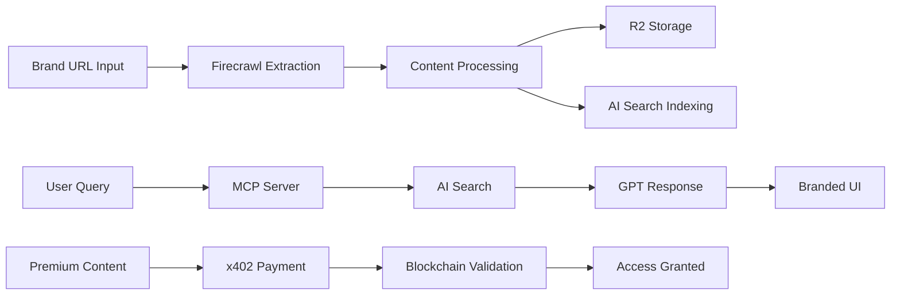

# 🚀 Tedix — Transform Your Brand into AI-Commerce in 5 Minutes

**🏆 Solana x402 Hackathon Submission — MCP Server Track + CDP Embedded Wallets Challenge**

**The future of AI commerce: Turn any brand into a white-labeled MCP server ready for ChatGPT deployment**

> **Problem:** AI chats give you walls of text from random sources - Reddit, blogs, anywhere. Never official brand content.
> **Solution:** Tedix transforms your brand into a premium MCP server with official content, branded UI components, and blockchain payments - all in 5 minutes.

    

## 🎯 **What is Tedix?**

**One URL. Five minutes. Your brand becomes an AI app.**

Enter your brand URL → We scrape all official content → Generate a white-labeled MCP server → Deploy to ChatGPT → Users get official branded responses with custom UI components and premium content gated by blockchain payments.

## 🌟 **See It In Action**

**[Watch the demo video](https://www.loom.com/share/a1a5644282854acb88db09af2aee152c):** Transform Solana into an MCP server in real-time

### **How It Works:**
1. 🔗 **Enter URL** → "solana.com"
2. 🕷️ **Smart Scraping** → Official docs, blog posts, brand content
3. 🤖 **MCP Generation** → White-labeled server with your branding
4. 💬 **ChatGPT Ready** → Deploy and start selling premium AI experiences
5. 💳 **x402 Payments** → Blockchain-powered premium content access

---

## 🏗️ **Tech Stack Architecture**

### 🎨 **Frontend — Next.js 16 + MCP UI**
- **Next.js 16** — App Router with server components
- **MCP UI Components** — Branded, customizable AI chat interfaces
- **x402 Coinbase CDP SDK** — Blockchain payment integration
- **TypeScript** — End-to-end type safety
- **Tailwind CSS** — Rapid UI development

### ⚡ **Backend — Hono + Cloudflare Workers**
- **Hono Framework** — Ultra-fast web framework for edge
- **Cloudflare Workers** — Global edge computing
- **AI Agents SDK** — MCP server implementation
- **x402 MCP** — Paid tools with blockchain validation
- **TypeScript** — Full type safety across the edge

### 🧠 **AI & Content Intelligence**
- **Firecrawl API** — Premium brand content extraction & mapping
- **Cloudflare AI Search** — Vector database with auto-embeddings
- **Cloudflare R2** — Object storage for scraped content
- **Cloudflare Vectorize** — Semantic search capabilities
- **OpenAI Integration** — GPT-4 powered responses

### 💾 **Storage & Database**
- **Cloudflare R2 Buckets** — Organized brand content (`/brands/{domain}/`)
- **Cloudflare AI Search** — Managed vector database with embeddings
- **Supabase PostgreSQL** — Brand data and content source references

---

## 🏆 **Hackathon Submission**

### **[Solana x402 Hackathon](https://solana.com/x402/hackathon)**

---

## 🚀 **Quick Start**

### Prerequisites
```bash
node >= 18
bun >= 1.0
wrangler >= 3.0
```

### Installation & Setup
```bash
# Clone the repository
git clone https://github.com/your-repo/tedix-402
cd tedix-402

# Frontend setup (TanStack Start)
cd frontend
bun install
cp .env.example .env.local
# Configure your environment variables

# Backend setup (Cloudflare Workers)
cd ../backend
bun install
cp wrangler.example.jsonc wrangler.jsonc
# Configure your Cloudflare settings
```

### Development
```bash
# Terminal 1: Frontend (TanStack Start)
cd frontend
bun run dev
# → http://localhost:3001

# Terminal 2: Backend (Cloudflare Workers)
cd backend
bun run dev
# → http://localhost:8787

# Visit: http://localhost:3001/playground
```

### Production Build
```bash
# Frontend build
cd frontend
bun run build

# Backend deploy
cd backend
bun run deploy
```

---

## 📂 **Project Structure**

```
tedix-x402-hack/
├── 🎨 frontend/                    # Next.js 16 App
│   ├── apps/
│   │   └── frontend/
│   │       ├── app/                # App Router pages
│   │       ├── components/         # React components
│   │       ├── lib/                # Core utilities
│   │       └── mcp-ui/            # MCP UI components
│   └── packages/
│       └── x402-mcp/              # x402 payment SDK
│
├── ⚡ backend/                      # Cloudflare Worker
│   ├── src/
│   │   ├── index.ts               # Hono app entry
│   │   ├── mcp/                   # MCP server tools
│   │   │   ├── ui.ts              # UI resources
│   │   │   └── tools.ts           # AI tools
│   │   ├── brand-discovery/       # Content pipeline
│   │   │   ├── firecrawl.ts      # Scraping service
│   │   │   └── processor.ts      # Data transform
│   │   └── services/
│   │       ├── ai-search.ts      # Vector search
│   │       └── r2.ts              # Storage
│   └── wrangler.toml              # Cloudflare config
│
├── 🎯 widget/                      # Embeddable widget
│   └── src/                       # Widget components
│
└── 📝 docs/
    ├── CLAUDE.md                  # AI instructions
    └── README.md                  # This file
```

## 🏗️ **Architecture Flow**



### **Pipeline Steps**
1. **Brand Discovery** → Enter domain, scrape with Firecrawl
2. **Content Storage** → Organize in R2 buckets by brand
3. **Vector Indexing** → Auto-embed with Cloudflare AI Search
4. **MCP Generation** → Create white-labeled server config
5. **ChatGPT Deploy** → Ready for AI conversations
6. **Premium Access** → x402 blockchain payments for gated content
7. **Branded UI** → Custom components with logo & colors

---

## 🎨 **Key Features**

### 🚀 **5-Minute Brand Transformation**
- **One-click setup** → Enter URL, get MCP server
- **Automatic content mapping** → Docs, blog, products, services
- **Smart categorization** → AI-powered content organization
- **White-label ready** → Your brand, your colors, your logo
- **Instant deployment** → ChatGPT marketplace ready

### 💡 **Revolutionary AI Commerce**
- **Official content only** → No more Reddit or random sources
- **Branded UI components** → Custom chat interfaces
- **Premium content gates** → Blockchain-powered monetization
- **Real-time updates** → Live brand intelligence
- **Multi-tenant architecture** → Unlimited brands

### 🔐 **x402 Blockchain Payments (Multi-Chain)**
- **Solana + Base chains** → Choose your blockchain
- **Premium tool access** → Gate advanced features
- **Usage-based pricing** → Pay per query or subscription
- **Instant validation** → On-chain verification
- **Coinbase CDP SDK** → Enterprise-grade infrastructure
- **Adapted x402-mcp** → Enhanced multi-chain support

---

## 🚀 **Use Cases**

### **For Brands**
- 🏢 **Enterprise SaaS** → "Get official Stripe API answers in ChatGPT"
- 🛍️ **E-commerce** → "Shop Nike products directly in AI chat"
- 📚 **Documentation** → "Access Solana docs with code examples"
- 💼 **B2B Services** → "Premium consulting through AI agents"
- 🎓 **Education** → "Sell courses and tutorials via chat"

### **For Developers**
- 🔧 **API Integration** → MCP tools for your platform
- 📖 **Documentation Assistant** → AI-powered tech support
- 💻 **Code Examples** → Context-aware programming help
- 🚀 **Developer Tools** → Premium SDK access
- 🤝 **Community Support** → Monetized expert answers

---

## 🔧 **Environment Configuration**

### Frontend (.env.local)
```env
# Next.js Configuration
NEXT_PUBLIC_API_URL=http://localhost:8787
NEXT_PUBLIC_NETWORK=mainnet

# x402 Payments
NEXT_PUBLIC_X402_API_KEY=your_x402_key
NEXT_PUBLIC_COINBASE_PROJECT_ID=your_project_id

# Development
NODE_ENV=development
```

### Backend (wrangler.jsonc)
```jsonc
{
  "name": "tedix-backend",
  "main": "src/index.ts",
  "compatibility_date": "2025-09-24",
  "compatibility_flags": [
    "nodejs_compat",
    "nodejs_compat_populate_process_env"
  ],

  // Durable Objects for MCP state
  "durable_objects": {
    "bindings": [
      { "name": "MCP_OBJECT", "class_name": "TedixMCP" },
      { "name": "TEDIX_AGENT", "class_name": "TedixAgent" }
    ]
  },

  // AI and Storage
  "ai": { "binding": "AI", "remote": true },
  "r2_buckets": [{
    "binding": "DEV_TEDIX_BUCKET",
    "bucket_name": "dev-tedix"
  }],

  // Environment variables
  "vars": {
    "AI_SEARCH_INSTANCE": "dev-tedix",
    "R2_BUCKET_NAME": "dev-tedix"
  }

  // Secrets (via wrangler secret put):
  // OPENAI_API_KEY, FIRECRAWL_API_KEY, X402_SECRET_KEY
}
```

---

## 💻 **Development Workflow**

### **Local Development**
```bash
# Frontend hot reload
cd frontend && bun run dev
# → Instant updates with TanStack Start

# Backend development
cd backend && bun run dev
# → Local Cloudflare Workers testing

# Type checking
bun run build:check
# → Full TypeScript validation
```
